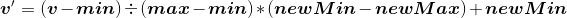
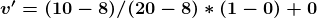

# simple-minmax-standardisation
A MinMax Standardisation for Machine Learning data

For 10, 

Original Data | MinMax-Standardisation
------------- | ----------------------
8 |0
10 |0.166667
15 |0.583333
20 |1
